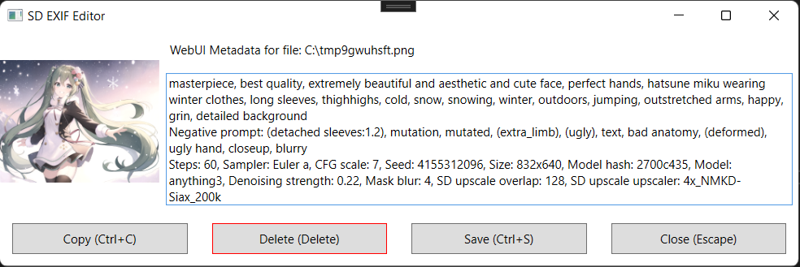

# SD EXIF Editor

Tiny tool for viewing and editing image metadata associated with [AUTOMATIC1111/stable-diffusion-webui](https://github.com/AUTOMATIC1111/stable-diffusion-webui) generation parameters

# Getting Started

## Dependencies

- Windows 7+
- .NET 6.0

## Release

Download zip from Release page

## Build

Build using Visual Studio 2022

# Usage

Open the .png file through this application in a convenient way
- Use command line
- Drop the file on `SD EXIF Editor.exe` or on link to it
- (Recommened) Use FastStone ImageViewer and add `SD EXIF Editor.exe` as External Program. Then use `E` shortcut

# Screenshot

# Features

- If the image contains the 'parameters' tag, its content will be displayed in the text box
- Global hotkeys for copying, deleting, saving and closing the app
- The 'used embeddings' part will be ignored on copying because the WebUI cannot handle parsing
- Image tooltip on hover
- File path tooltip on hover

# Note

NovelAI metadata not yet supported
Metadata tag name can be changed on build
